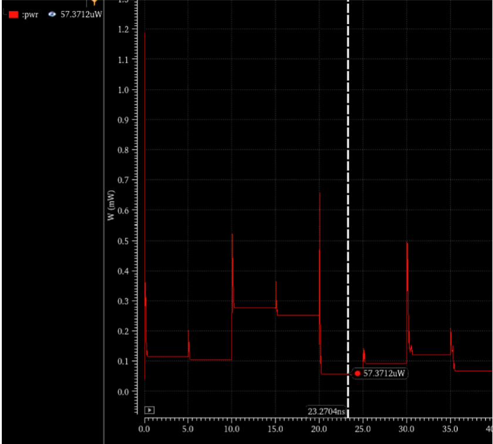
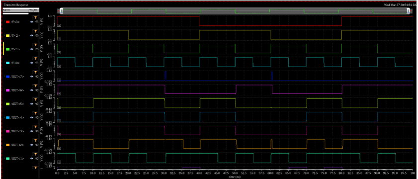
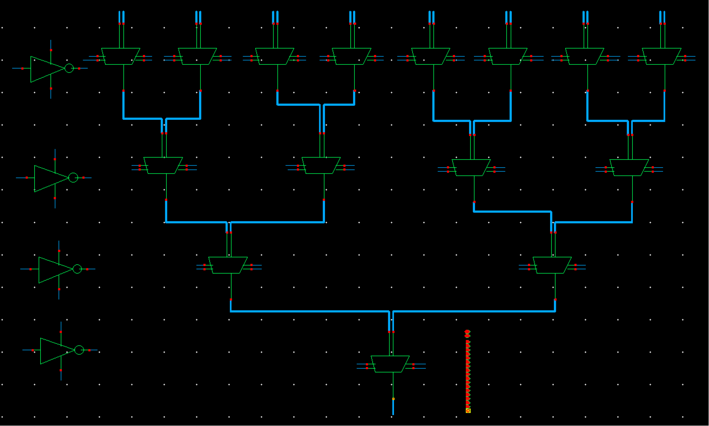
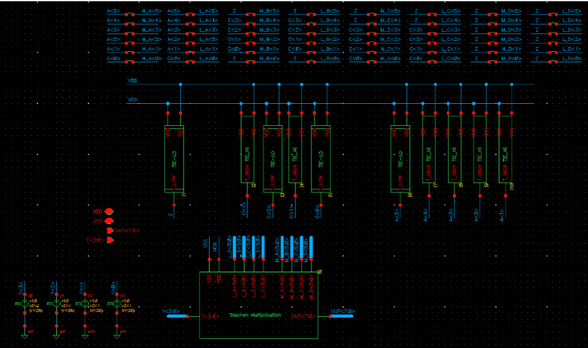

# LUNA-CiM 4×4 Multiplier (VLSI)

**Author:** Stephen Singh  

---

## Table of Contents
1. [Project Overview](#project-overview)   
2. [Introduction](#introduction)  
3. [Methodology](#methodology)  
   - [Expanding 2×1 MUX to 6-bit](#expanding-2×1-mux-to-6-bit)  
   - [Creating 4×1 MUX 6-bit](#creating-4×1-mux-6-bit)  
   - [Component Design](#component-design)  
     - [NOT Block](#not-block)  
     - [Multiplication Block](#multiplication-block)  
     - [LUNA-CiM 4×4 LUT Multiplier](#luna-cim-4×4-lut-multiplier)  
4. [Results](#results)  
   - [Power Consumption](#power-consumption)  
     - [Static Power](#static-power)  
     - [Average Power](#average-power)  
     - [Energy per Calculation](#energy-per-calculation)  
   - [Input & Output Waveforms](#input--output-waveforms)  
5. [Conclusion](#conclusion)  
6. [Appendix](#appendix)  

---

## Project Overview
This project implements and evaluates a low-energy, area-efficient 4×4 integer multiplier—termed **LUNA-CiM**—using the Divide & Conquer (D&C) approach in a 45 nm CMOS process (gpdk045). By reusing optimized full-adders, half-adders, multiplexers, buffers, and inverters, LUNA-CiM minimizes SRAM cell usage and delivers competitive power and area metrics versus traditional LUT-based designs.

---

## Introduction
Multipliers are central to DSP and cryptographic hardware, but conventional architectures incur high power and area costs. LUNA-CiM uses a D&C methodology to partition the 4×4 multiplication into smaller, parallel subproblems, then recombine results with minimal storage overhead.

---

## Methodology

### Expanding 2×1 MUX to 6-bit
- Replicate a standard 2→1 multiplexer six times.
- Bundle them into a single `mux2to1_6bit` symbol using VHDL wide-wire/bus notation.

### Creating 4×1 MUX 6-bit
- Implement a 4→1 mux by cascading three 2→1 muxes (N–1 formula).
- Consolidate into `mux4to1_6bit` to select one of four 6-bit inputs.

### Component Design

#### NOT Block
- Inverts each bit of the 4-bit operand `Y<3:0>` using six inverters per bit slice.
- Outputs both original and inverted signals (labels `LSx`, `LSxB`, etc.) for downstream MUXes.

#### Multiplication Block
- Instantiates 3 full-adders, 3 half-adders, 2 buffers, 2 × `mux4to1_6bit`, and the NOT block.
- Handles partial product reduction and carry propagation for 4-bit inputs.

#### LUNA-CiM 4×4 LUT Multiplier
- Stores precomputed weights (`Wx00`–`Wx11`) in TIE-HI/LO cell arrays.
- Uses D&C to compute each 6-bit partial product and assemble the final 8-bit result.
- Input stimuli (`Y<3:0>`) driven by Vpulse constraints:
  - `Y<3>`: 80 ns period, 50% duty
  - `Y<2>`: 40 ns period, 50% duty
  - `Y<1>`: 20 ns period, 50% duty
  - `Y<0>`: 10 ns period, 50% duty

---

## Results

### Power Consumption

#### Static Power
  
Measured **57.37 µW** static draw at nominal voltage.

#### Average Power
  
Recorded **146.7 µW** average consumption under dynamic operation.

#### Energy per Calculation
  
Achieved **676 fJ** per 4×4 multiplication (16-input cycles).

### Input & Output Waveforms
  
Shows `Y<3:0>` stimuli versus resulting `OUT<7:0>`; output spikes are highlighted.

---

## Conclusion
The LUNA-CiM 4×4 multiplier demonstrates substantial power savings and area efficiency compared to LUT-based counterparts, with low static power and sub-pJ calculation energy. Future work will target spike mitigation, deeper pipelining, and exploration of 8×8 extensions.

---

## Appendix
- **Figure A1:** 4×1 MUX 6-bit Schematic 
 
- **Figure A2:** Final LUNA-CiM Schematic 
 

